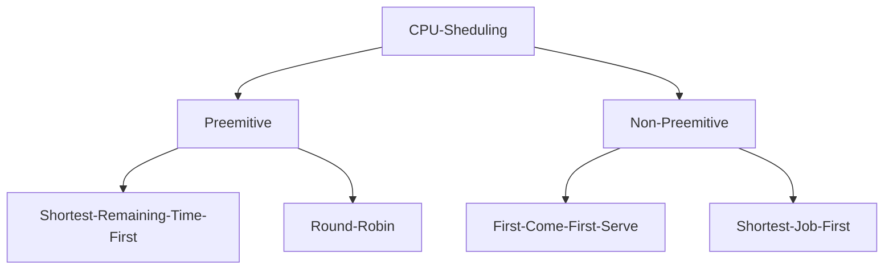

# Scheduling algorithms
Implementation of scheduling algorithms in operating systems in C.

## Preemptive Scheduling
In Preemptive Scheduling, the tasks are mostly assigned with their priorities. Sometimes it is important to run a task with a higher priority before another lower priority task, even if the lower priority task is still running. The lower priority task holds for some time and resumes when the higher priority task finishes its execution.

## Non-Preemptive Scheduling
In this type of scheduling method, the CPU has been allocated to a specific process. The process that keeps the CPU busy will release the CPU either by switching context or terminating. It is the only method that can be used for various hardware platforms. That’s because it doesn’t need special hardware (for example, a timer) like preemptive scheduling.

## Scheduling Terminologies
- Burst Time/Execution Time: It is a time required by the process to complete execution. It is also called running time.
- Arrival Time: when a process enters in a ready state
- Finish Time: when process complete and exit from a system
- Process: It is the reference that is used for both job and user.
- CPU/IO burst cycle: Characterizes process execution, which alternates between CPU and I/O activity.



## Execution
To complile each .c file run
```console
make [file]
```
To complile all .c files just run
```console
make
```
To execute an algorithm for a specific test case run
```console
./[algorithm] | tests/INPUT[index]
```
To test the algorithms for all the available tests (/tests subfolder)
```console
make tests
```
Input format
```
number-of-processes(N)
quantum
process-index0 arrival-time0 burst-time0
process-index1 arrival-time1 burst-time1
...
process-indexN-1 arrival-timeN-1 burst-timeN-1
```